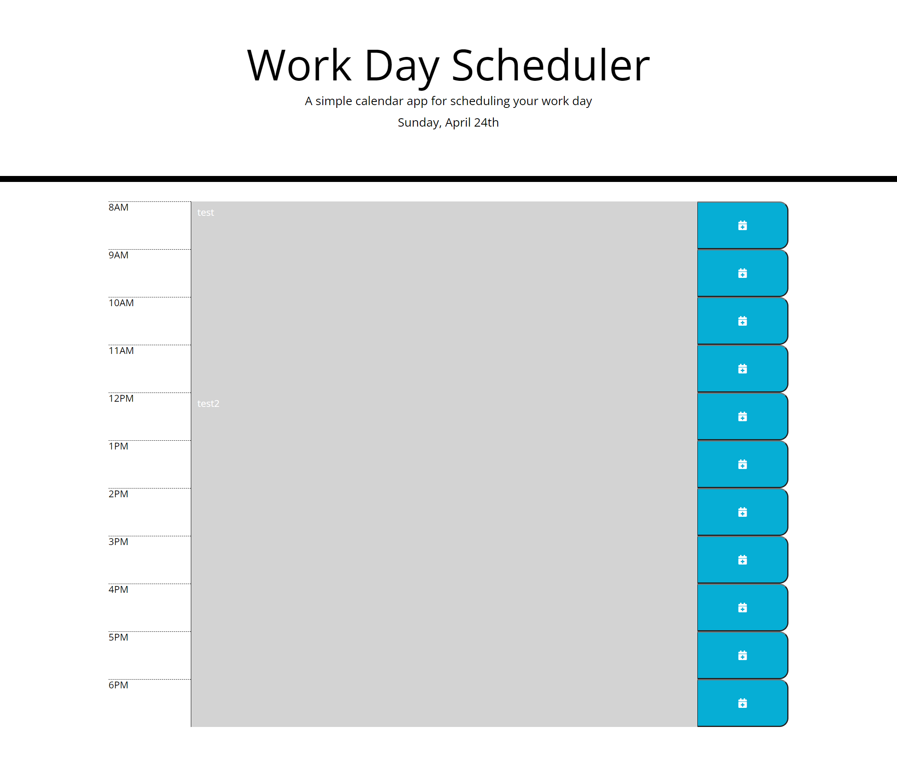

# 05-Third-Party-APIs-Work-Day-Scheduler

# Description
A Work Day Scheduler that opens to today's date. Timeblocks are avaiable fro 8am to 6pm and are color coded to indicate whether it is in the past, present, or future. After typing an event for a specific block, click the save button. The event is then saved to the local storage to remain available on refresh.

# Github Links
Repository: https://github.com/favalos06/05-Third-Party-APIs-Work-Day-Scheduler
Live Page: https://favalos06.github.io/05-Third-Party-APIs-Work-Day-Scheduler/

# Preview

  
